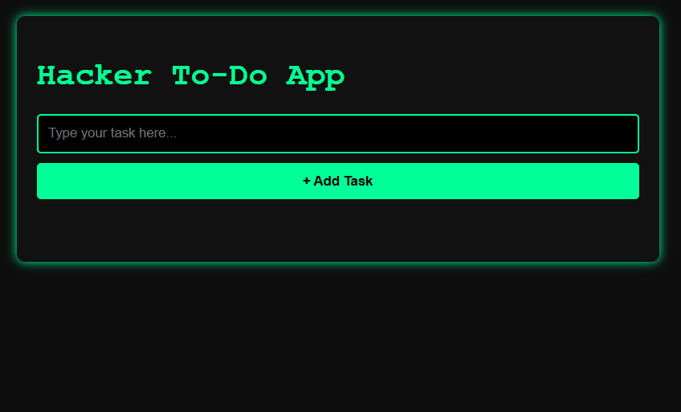

# 🖥️ Hacker-Style ToDo App

A **dark terminal-inspired ToDo web app** built with **HTML, CSS, and JavaScript**.  
Designed with a **hacker theme (green on black)** to match a terminal look.  

🚀 Live Demo: [Click Here](https://your-live-link.netlify.app)  
📂 GitHub Repo: [Click Here](https://github.com/ksridhar-nist/todo-app)

---

## ✨ Features
- ✅ Add tasks dynamically  
- 🖱️ Click a task to mark it as **done** (strikethrough effect)  
- ❌ Delete tasks with a **red X button**  
- 🎨 **Dark terminal-style theme** (green text on black background)  
- 📱 Responsive design (works on mobile & desktop)  

---

## 🛠️ Tech Stack
- **Frontend:** HTML, CSS, JavaScript  
- **Styling:** Custom CSS (hacker/terminal theme)  
- **Hosting:** Netlify / Vercel  

---

## 📸 Screenshots  

### 🔹 Homepage


### 🔹 Adding Tasks


---

## 🚀 Getting Started

### 1️⃣ Clone the repo
```bash
git clone https://github.com/ksridhar-nist/hacker-todo-app.git
cd todo-app
